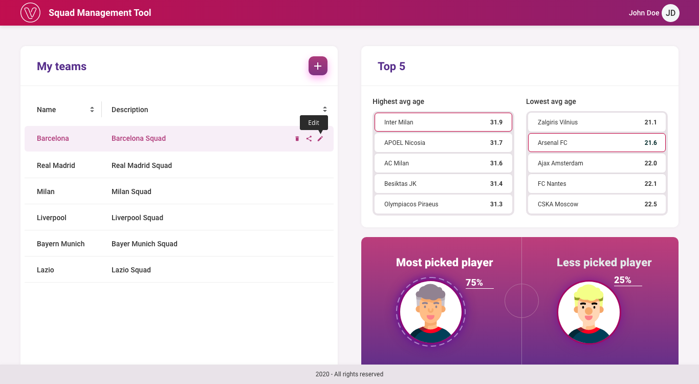
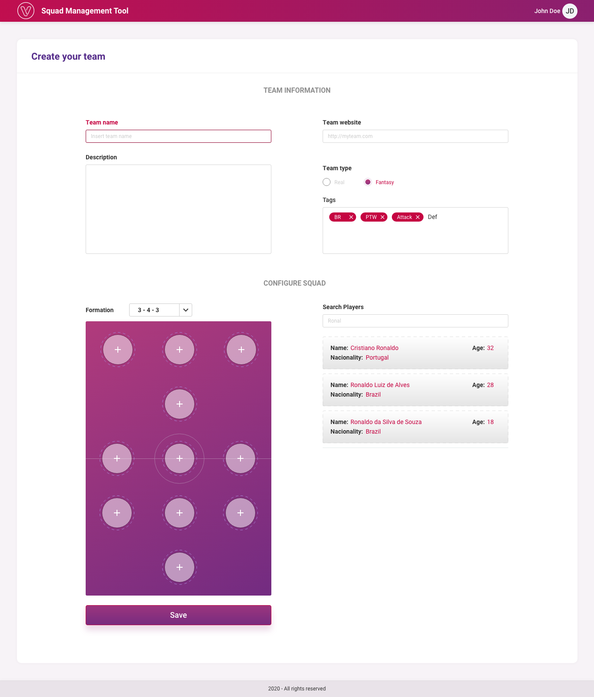

# Squad Management Tool
> Venturus technical challenge for Front-End Developer!

## Table of contents
* [General info](#general-info)
* [Screenshots](#screenshots)
* [Technologies](#technologies)
* [Setup](#setup)
* [Features](#features)
* [Status](#status)
* [Contact](#contact)

## General info
Squad Management Tool is a tool (web application) that guides users toward creating and configuring soccer teams, it also shows statistics about the current teams.

## Screenshots



## Technologies
* React
* Typescript
* styled-components
* react-router-dom

## Setup

### Local environment

* It's necessary to have Git installed
* It's necessary to have Node.js installed
* It's necessary to have a package manager be it NPM or Yarn installed

### How to install

```bash
# Clone Repository
$ git clone https://github.com/wjuniori/squad-management-tool.git

# Go to Project Folder
$ cd squad-management-tool

# Install Dependencies
$ yarn install

# Run Aplication
$ yarn start
```

### Demo version

You can acess the demo website at: https://squad-management-tool.vercel.app/

## Features
List of features ready:
* Implement Page Layout.
* Implement "My teams" section.
* Implement "Top 5" section.
* Ability to Create/Edit and Remove a team.

To-do list:
* Adjust page layout and responsiveness.
* Implement "most/less picked player" section
* Implement "Configure Squad" section.

## Status
Project is: _in progress_.

## Contact
Created and maintained by **[Washington Júnior](https://github.com/wjuniori/)**.
